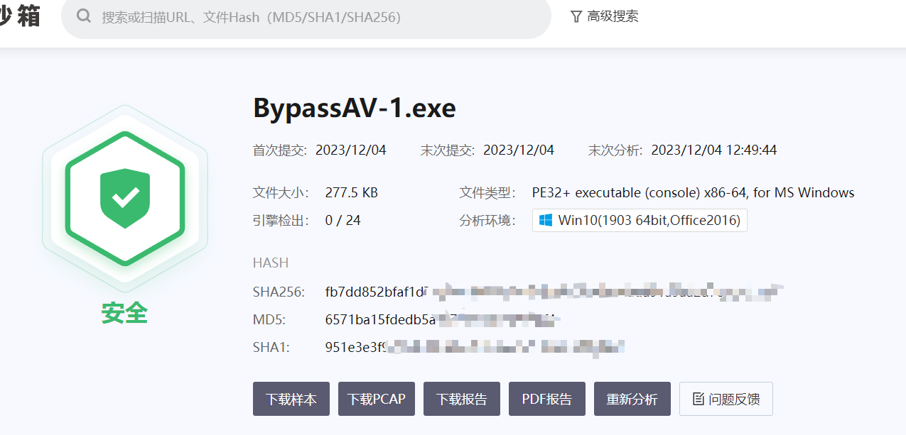
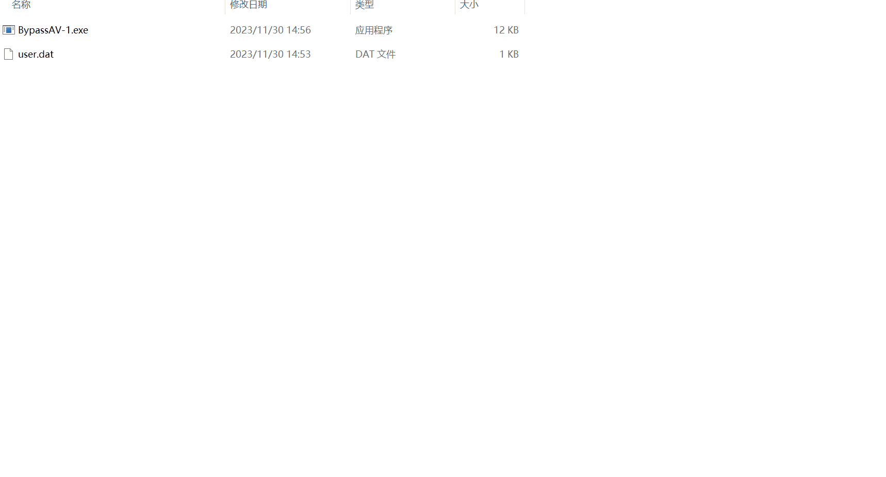
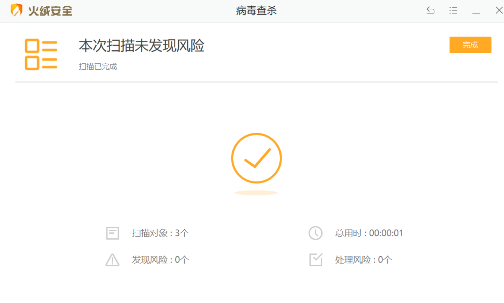

> 免责声明：本工具仅用于安全研究和教学目的，用户应自行承担因使用该工具而引起的一切法律和相关责任。作者不对任何法律责任承担责任。


# 更新日志

https://mp.weixin.qq.com/s/L3d7w-u__T1zeL5rze4M0A

经过删除 pdb 信息，加 icon 运行时库改为 /MT 后，可以某步全绿

读文件的方法改为 WINAPI

# BypassAV-1
通过分离的方式规避杀软

读入 Msfvenom 或 Cobalt Strike 等 C2 的 Shellcode 方式分离免杀

或者配合 donut 可以将 exe、dll 转为 Shellcode 载入 MimiKatz 等工具

# 使用方法
使用 Visual Studio 2022 打开，然后选择 Release 编译

自定义一个 key，然后使用 xorencrypt.py 将 Shellcode 加密

```sh
> python .\xorencrypt.py .\calc.bin
> xor encrypted : .\calc_encrypted.bin
```

将加密后的文件名作为参数传递给 fopen

```cpp
	//修改这里
	char key[] = "key";

	//修改这里
	fp = fopen("user.dat", "rb");
```


# 效果


其他杀软请自测






# 更新记录

增加 xor 加密
